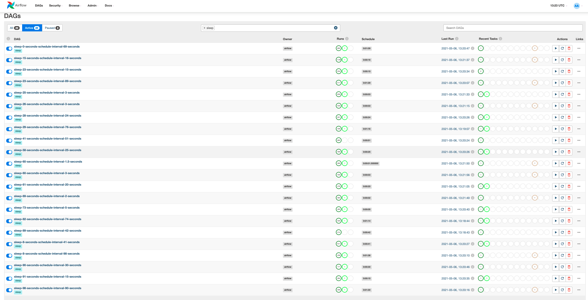

Testing out Airflow's behavior when a task takes much longer than it's scheduled interval.

To run locally, run `docker-compose up`, go to http://localhost:8080 when the webserver is ready,
sign in with user and password `airflow`, and activate the two DAGs in this project.

Here are some of the DAG Runs

I then created more DAGs with random task and scheduled interval durations, set the task pool to 10, so that
only 10 dags could run at a time (total of 22 active DAGs) and left it running overnight.
Here are the number of completed runs (dark green circles under the `Runs` column):

The one outlier that stands out to me is the `sleep-90-seconds-schedule-interval-30-seconds` DAG,
which ran less than 180 times. Looking at the scheduled runs, there were times where it didn't run
for more than 30 minutes. In contrast, the `sleep-98-seconds-schedule-interval-90-seconds` DAG ran almost 300
times.
